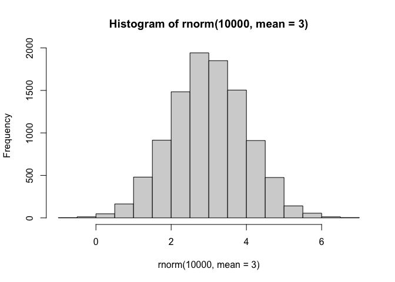
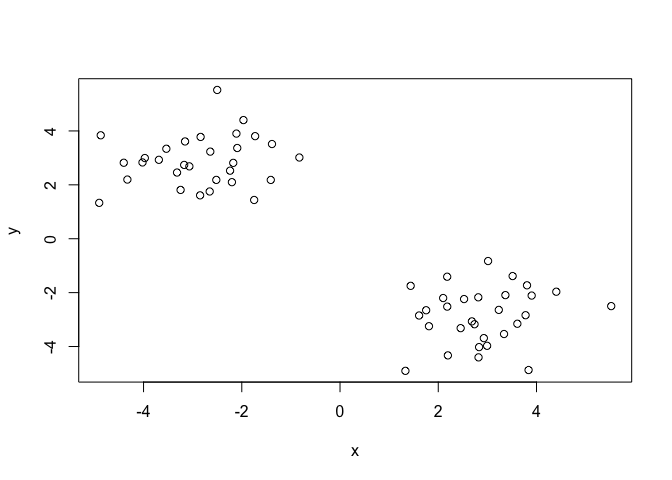
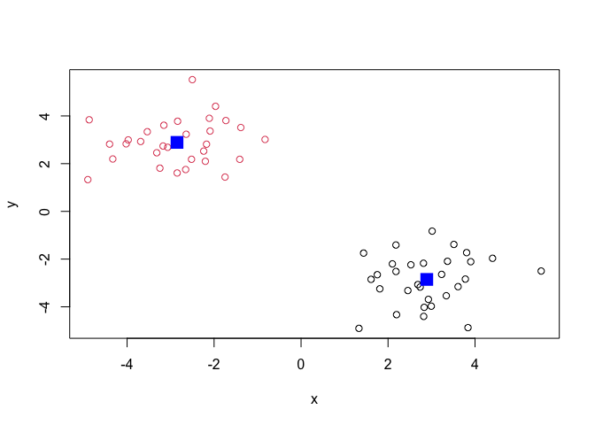
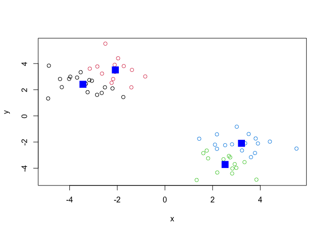
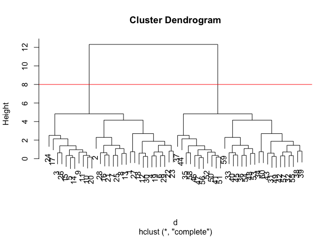
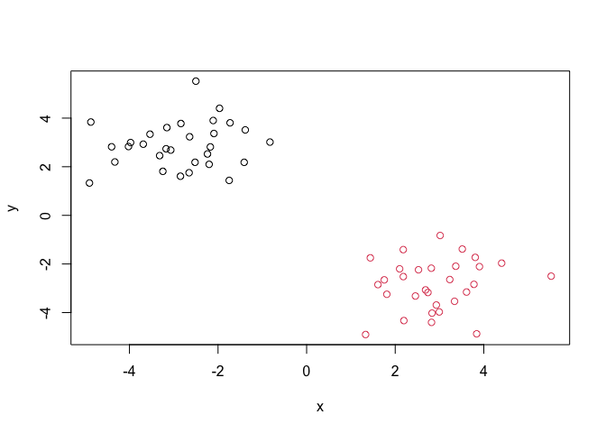
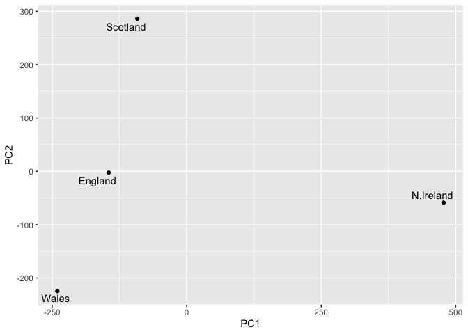

# Class 7: Machine Learning 1
Sarah Mirsaidi Madjdabadi, A16890186

- [Clustering](#clustering)
  - [K-means](#k-means)
- [Principal Component Analysis
  (PCA)](#principal-component-analysis-pca)
  - [Data import](#data-import)
  - [PCA to the rescue](#pca-to-the-rescue)

Today we will explore unsupervised machine learning methods starting
with clustering and dimensionality reduction.

## Clustering

To start let’s make up some data to cluster where we know what the
answer should be. The `rnorm()` function will help us here.

``` r
hist( rnorm(10000, mean=3) )
```



Return 30 numbers centered on -3.

``` r
tmp <- c( rnorm(30, mean=-3),
  rnorm (30, mean=3))

x <- cbind(x=tmp, y=rev(tmp))

x
```

                   x          y
     [1,] -1.3851179  3.5142750
     [2,] -2.5003754  5.5207713
     [3,] -4.3290684  2.1958137
     [4,] -2.1739698  2.8149516
     [5,] -3.0673557  2.6851964
     [6,] -2.5190842  2.1827230
     [7,] -3.1549533  3.6099386
     [8,] -2.0924726  3.3666880
     [9,] -3.5359334  3.3390222
    [10,] -3.9738537  2.9942079
    [11,] -3.6880914  2.9280216
    [12,] -2.6534505  1.7531510
    [13,] -2.6412016  3.2322315
    [14,] -3.1730477  2.7384457
    [15,] -3.3180143  2.4562410
    [16,] -2.1092137  3.9015590
    [17,] -4.8714608  3.8384960
    [18,] -3.2459352  1.8108806
    [19,] -2.2386390  2.5252672
    [20,] -4.0214983  2.8309448
    [21,] -1.7285216  3.8067762
    [22,] -1.7481527  1.4378745
    [23,] -1.4097179  2.1816032
    [24,] -4.9027603  1.3310288
    [25,] -2.8382914  3.7775542
    [26,] -4.4027499  2.8195940
    [27,] -0.8276523  3.0140577
    [28,] -1.9663703  4.4028835
    [29,] -2.2007009  2.0993757
    [30,] -2.8487166  1.6099538
    [31,]  1.6099538 -2.8487166
    [32,]  2.0993757 -2.2007009
    [33,]  4.4028835 -1.9663703
    [34,]  3.0140577 -0.8276523
    [35,]  2.8195940 -4.4027499
    [36,]  3.7775542 -2.8382914
    [37,]  1.3310288 -4.9027603
    [38,]  2.1816032 -1.4097179
    [39,]  1.4378745 -1.7481527
    [40,]  3.8067762 -1.7285216
    [41,]  2.8309448 -4.0214983
    [42,]  2.5252672 -2.2386390
    [43,]  1.8108806 -3.2459352
    [44,]  3.8384960 -4.8714608
    [45,]  3.9015590 -2.1092137
    [46,]  2.4562410 -3.3180143
    [47,]  2.7384457 -3.1730477
    [48,]  3.2322315 -2.6412016
    [49,]  1.7531510 -2.6534505
    [50,]  2.9280216 -3.6880914
    [51,]  2.9942079 -3.9738537
    [52,]  3.3390222 -3.5359334
    [53,]  3.3666880 -2.0924726
    [54,]  3.6099386 -3.1549533
    [55,]  2.1827230 -2.5190842
    [56,]  2.6851964 -3.0673557
    [57,]  2.8149516 -2.1739698
    [58,]  2.1958137 -4.3290684
    [59,]  5.5207713 -2.5003754
    [60,]  3.5142750 -1.3851179

Make a plot of `x`

``` r
plot(x)
```



### K-means

The main function in “base” R for K-means clustering is called
`kmeans()`:

``` r
km <- kmeans(x, centers = 2)
km
```

    K-means clustering with 2 clusters of sizes 30, 30

    Cluster means:
              x         y
    1  2.890651 -2.852212
    2 -2.852212  2.890651

    Clustering vector:
     [1] 2 2 2 2 2 2 2 2 2 2 2 2 2 2 2 2 2 2 2 2 2 2 2 2 2 2 2 2 2 2 1 1 1 1 1 1 1 1
    [39] 1 1 1 1 1 1 1 1 1 1 1 1 1 1 1 1 1 1 1 1 1 1

    Within cluster sum of squares by cluster:
    [1] 56.96558 56.96558
     (between_SS / total_SS =  89.7 %)

    Available components:

    [1] "cluster"      "centers"      "totss"        "withinss"     "tot.withinss"
    [6] "betweenss"    "size"         "iter"         "ifault"      

The `kmeans()` returns a “list” with 9 components. You can see the anmed
components of any list with the `attributes()` function.

``` r
attributes(km)
```

    $names
    [1] "cluster"      "centers"      "totss"        "withinss"     "tot.withinss"
    [6] "betweenss"    "size"         "iter"         "ifault"      

    $class
    [1] "kmeans"

> Q. How many points are in each cluster?

``` r
km$size
```

    [1] 30 30

> Q. Cluster assignment/membership vector?

``` r
km$cluster
```

     [1] 2 2 2 2 2 2 2 2 2 2 2 2 2 2 2 2 2 2 2 2 2 2 2 2 2 2 2 2 2 2 1 1 1 1 1 1 1 1
    [39] 1 1 1 1 1 1 1 1 1 1 1 1 1 1 1 1 1 1 1 1 1 1

> Q. Cluster centers?

``` r
km$centers
```

              x         y
    1  2.890651 -2.852212
    2 -2.852212  2.890651

> Q. Make a plot of our `kmeans()` results showing cluster alignment
> using different colors for each cluster/group of points and cluster
> centers in blue.

``` r
plot(x,col=km$cluster)
points(km$centers, col="blue", pch=15, cex=2)
```



> Q. Run `kmeans()` again on `x` and this cluster into 4 groups/clusters
> and plot the same result figure as above.

``` r
km4 <- kmeans(x, centers = 4)
plot(x,col=km4$cluster)
points(km4$centers, col="blue", pch=15, cex=2)
```



> **key-point**: K-means clustering is super popular but can be misused.
> One big limitation is that it can impose a clustering pattern on your
> data even if clear natural group doesn’t exist - i.e. it does what you
> tell it to do in terms of `centers`.

\###Hierarchical Clustering

The main function in “base” R for hierarchical clustering is called
`hclust()`.

You can’t just pass our dataset as it is into `hclust()`. You must give
“distance matrix” as input. We can get this from the `dist()` function
in R.

``` r
d <- dist(x)
hc <- hclust(d)
hc
```


    Call:
    hclust(d = d)

    Cluster method   : complete 
    Distance         : euclidean 
    Number of objects: 60 

The results of `hclust()` don’t have a useful print method, but do have
a special `plot()` method.

``` r
plot(hc)
abline(h=8,col="red")
```



To get our main cluster assignment (membership vector) we need to “cut”
the tree at the big goalposts…

``` r
grps <- cutree(hc, h=8)
grps
```

     [1] 1 1 1 1 1 1 1 1 1 1 1 1 1 1 1 1 1 1 1 1 1 1 1 1 1 1 1 1 1 1 2 2 2 2 2 2 2 2
    [39] 2 2 2 2 2 2 2 2 2 2 2 2 2 2 2 2 2 2 2 2 2 2

``` r
table(grps)
```

    grps
     1  2 
    30 30 

``` r
plot(x, col=grps)
```



Hierarchical clustering is distinct in that the dendrogram (tree figure)
can reveal the potential grouping in your data (unlike K-means).

## Principal Component Analysis (PCA)

PCA is a common and highly useful dimensionality reduction technique
used in many fields - particularly bioinformatics.

Here we will analyze some data from the UK on food consumption.

### Data import

``` r
url <- "https://tinyurl.com/UK-foods"
x <- read.csv(url)

head(x)
```

                   X England Wales Scotland N.Ireland
    1         Cheese     105   103      103        66
    2  Carcass_meat      245   227      242       267
    3    Other_meat      685   803      750       586
    4           Fish     147   160      122        93
    5 Fats_and_oils      193   235      184       209
    6         Sugars     156   175      147       139

``` r
rownames(x) <- x[ ,1]
x <- x[ , -1]
head(x)
```

                   England Wales Scotland N.Ireland
    Cheese             105   103      103        66
    Carcass_meat       245   227      242       267
    Other_meat         685   803      750       586
    Fish               147   160      122        93
    Fats_and_oils      193   235      184       209
    Sugars             156   175      147       139

``` r
x <- read.csv(url, row.names = 1)
head(x)
```

                   England Wales Scotland N.Ireland
    Cheese             105   103      103        66
    Carcass_meat       245   227      242       267
    Other_meat         685   803      750       586
    Fish               147   160      122        93
    Fats_and_oils      193   235      184       209
    Sugars             156   175      147       139

``` r
barplot(as.matrix(x), beside=T, col=rainbow(nrow(x)))
```


``` r
barplot(as.matrix(x), beside=F, col=rainbow(nrow(x)))
```


One conventional plot that can be useful is called a “paris” plot.

``` r
pairs(x, col=rainbow(nrow(x)), pch=16)
```


### PCA to the rescue

The main function in “base” R for PCA `prcomp()`.

``` r
pca <- prcomp( t(x) )
summary(pca)
```

    Importance of components:
                                PC1      PC2      PC3       PC4
    Standard deviation     324.1502 212.7478 73.87622 2.921e-14
    Proportion of Variance   0.6744   0.2905  0.03503 0.000e+00
    Cumulative Proportion    0.6744   0.9650  1.00000 1.000e+00

The `prcomp()` function returns a list object of our results with five
attributes/components.

``` r
attributes(pca)
```

    $names
    [1] "sdev"     "rotation" "center"   "scale"    "x"       

    $class
    [1] "prcomp"

The two main “results” in here are `pca$x` and `pca$rotation`. The first
of these (`pca$x`) contains the scores of the data on the new PC axis -
we use these to make our “PCA plot”.

``` r
pca$x
```

                     PC1         PC2        PC3           PC4
    England   -144.99315   -2.532999 105.768945 -9.152022e-15
    Wales     -240.52915 -224.646925 -56.475555  5.560040e-13
    Scotland   -91.86934  286.081786 -44.415495 -6.638419e-13
    N.Ireland  477.39164  -58.901862  -4.877895  1.329771e-13

``` r
library(ggplot2)
library(ggrepel)

# Make a plot of pca$x with PC1 vs PC2
ggplot(pca$x) +
  aes(PC1, PC2, label=rownames(pca$x)) +
  geom_point() +
  geom_text_repel()
```



The above plot shows that the eating habits in Ireland are very
different compared to England, Wales, and Scotland.

The second major result is contained in the `pca$rotation` object or
component. Let’s plot this to see what PCA is picking up…

``` r
pca$rotation
```

                                 PC1          PC2         PC3          PC4
    Cheese              -0.056955380  0.016012850  0.02394295 -0.409382587
    Carcass_meat         0.047927628  0.013915823  0.06367111  0.729481922
    Other_meat          -0.258916658 -0.015331138 -0.55384854  0.331001134
    Fish                -0.084414983 -0.050754947  0.03906481  0.022375878
    Fats_and_oils       -0.005193623 -0.095388656 -0.12522257  0.034512161
    Sugars              -0.037620983 -0.043021699 -0.03605745  0.024943337
    Fresh_potatoes       0.401402060 -0.715017078 -0.20668248  0.021396007
    Fresh_Veg           -0.151849942 -0.144900268  0.21382237  0.001606882
    Other_Veg           -0.243593729 -0.225450923 -0.05332841  0.031153231
    Processed_potatoes  -0.026886233  0.042850761 -0.07364902 -0.017379680
    Processed_Veg       -0.036488269 -0.045451802  0.05289191  0.021250980
    Fresh_fruit         -0.632640898 -0.177740743  0.40012865  0.227657348
    Cereals             -0.047702858 -0.212599678 -0.35884921  0.100043319
    Beverages           -0.026187756 -0.030560542 -0.04135860 -0.018382072
    Soft_drinks          0.232244140  0.555124311 -0.16942648  0.222319484
    Alcoholic_drinks    -0.463968168  0.113536523 -0.49858320 -0.273126013
    Confectionery       -0.029650201  0.005949921 -0.05232164  0.001890737

``` r
ggplot(pca$rotation) +
  aes(PC1, rownames(pca$rotation))+
  geom_col()
```


The above plot expands on the previous one. It specifically shows how
the eating habits of the people of Ireland are different from England,
Wales, and Scotland. For example, Irish people consume more potatoes and
soft drinks while the others drink more alcohol and eat more fresh
fruit.
