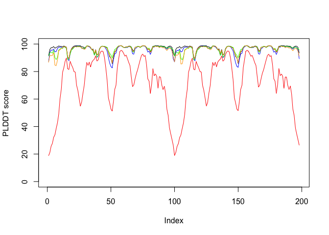
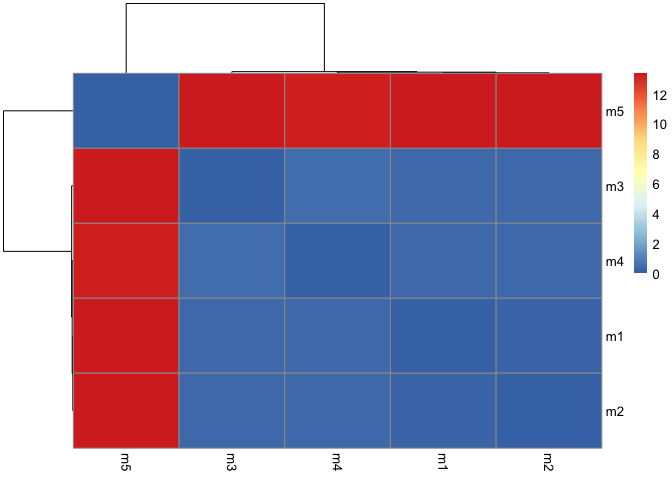
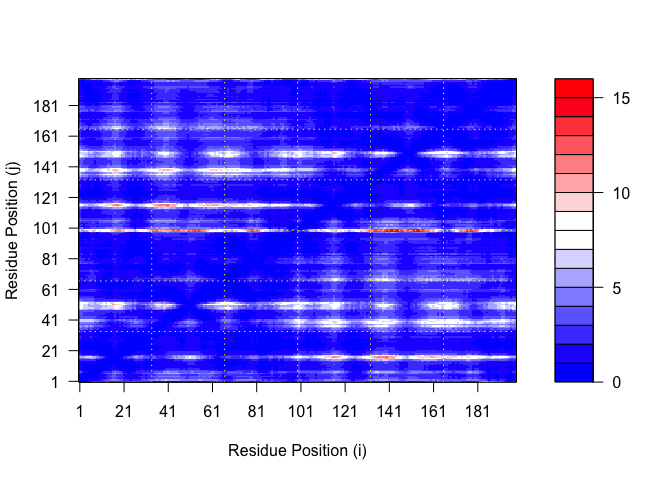
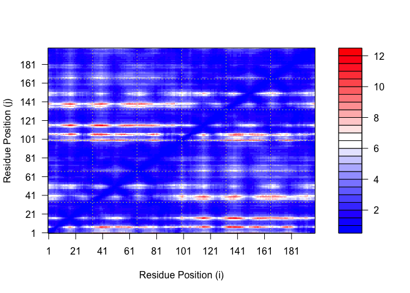
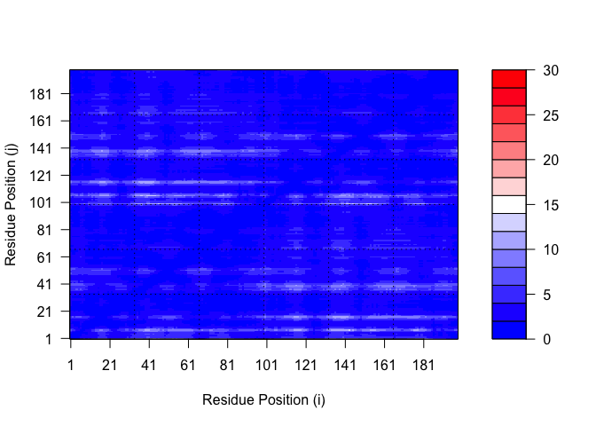
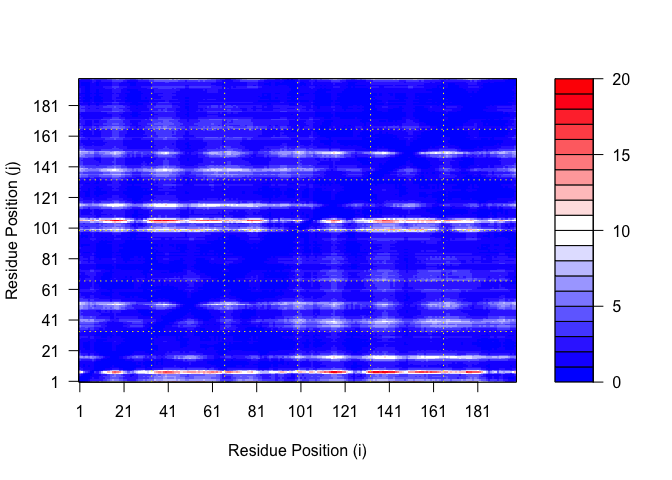
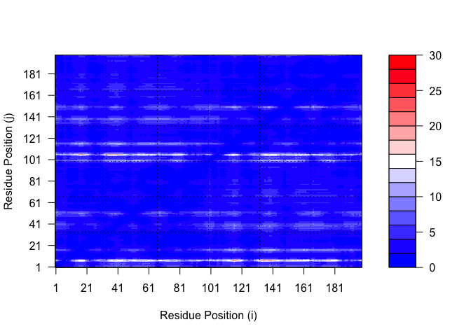
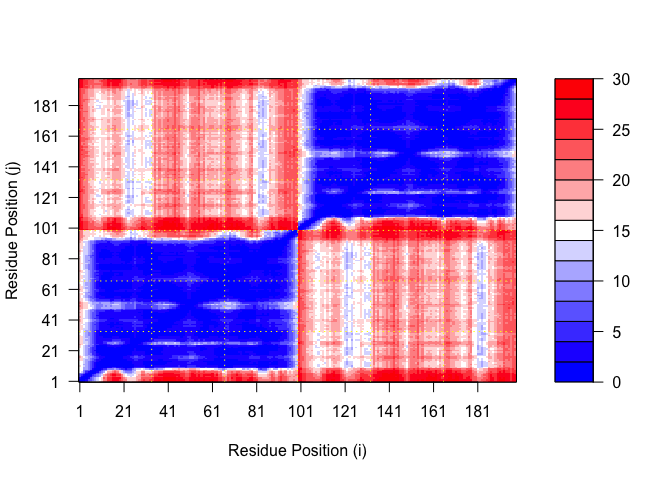

# Class 11: AlphaFold
Sarah Mirsaidi Madjdabadi, A16890186

Here we read the results from AlphaFold and try to interpret all the
models and quality score metrics:

``` r
library(bio3d)

pth <- "dimer_23119/"
pdb.files <- list.files(path = pth, full.names = TRUE, pattern = ".pdb")
```

Align and supperpose all these models

``` r
file.exists(pdb.files)
```

    [1] TRUE TRUE TRUE TRUE TRUE

``` r
pdbs <- pdbaln(pdb.files, fit = TRUE, exefile="msa")
```

    Reading PDB files:
    dimer_23119//dimer_23119_unrelaxed_rank_001_alphafold2_multimer_v3_model_2_seed_000.pdb
    dimer_23119//dimer_23119_unrelaxed_rank_002_alphafold2_multimer_v3_model_5_seed_000.pdb
    dimer_23119//dimer_23119_unrelaxed_rank_003_alphafold2_multimer_v3_model_4_seed_000.pdb
    dimer_23119//dimer_23119_unrelaxed_rank_004_alphafold2_multimer_v3_model_1_seed_000.pdb
    dimer_23119//dimer_23119_unrelaxed_rank_005_alphafold2_multimer_v3_model_3_seed_000.pdb
    .....

    Extracting sequences

    pdb/seq: 1   name: dimer_23119//dimer_23119_unrelaxed_rank_001_alphafold2_multimer_v3_model_2_seed_000.pdb 
    pdb/seq: 2   name: dimer_23119//dimer_23119_unrelaxed_rank_002_alphafold2_multimer_v3_model_5_seed_000.pdb 
    pdb/seq: 3   name: dimer_23119//dimer_23119_unrelaxed_rank_003_alphafold2_multimer_v3_model_4_seed_000.pdb 
    pdb/seq: 4   name: dimer_23119//dimer_23119_unrelaxed_rank_004_alphafold2_multimer_v3_model_1_seed_000.pdb 
    pdb/seq: 5   name: dimer_23119//dimer_23119_unrelaxed_rank_005_alphafold2_multimer_v3_model_3_seed_000.pdb 

``` r
library(bio3dview)
```

``` r
view.pdbs(pdbs)
```

``` r
plot(pdbs$b[1,], typ="l", ylim=c(0,100), ylab="PLDDT score")
lines(pdbs$b[2,],typ="l", col="blue")
lines(pdbs$b[3,],typ="l", col="green")
lines(pdbs$b[4,],typ="l", col="orange")
lines(pdbs$b[5,],typ="l", col="red")
```



``` r
rd <- rmsd(pdbs)
```

    Warning in rmsd(pdbs): No indices provided, using the 198 non NA positions

``` r
library(pheatmap)

colnames(rd) <- paste0("m",1:5)
rownames(rd) <- paste0("m",1:5)
pheatmap(rd)
```



``` r
library(jsonlite)

# Listing of all PAE JSON files
pae_files <- list.files(path=pth,
                        pattern=".*model.*\\.json",
                        full.names = TRUE)
```

``` r
pae1 <- read_json(pae_files[1],simplifyVector = TRUE)
pae2 <- read_json(pae_files[2],simplifyVector = TRUE)
pae3 <- read_json(pae_files[3],simplifyVector = TRUE)
pae4 <- read_json(pae_files[4],simplifyVector = TRUE)
pae5 <- read_json(pae_files[5],simplifyVector = TRUE)

attributes(pae1)
```

    $names
    [1] "plddt"   "max_pae" "pae"     "ptm"     "iptm"   

``` r
# Per-residue pLDDT scores 
#  same as B-factor of PDB..
head(pae1$plddt)
```

    [1] 91.44 96.06 97.38 97.38 98.19 96.94

``` r
pae1$max_pae
```

    [1] 13.57812

``` r
pae2$max_pae
```

    [1] 15.71094

``` r
pae3$max_pae
```

    [1] 12.41406

``` r
# Best (lowest) PAE score
```

``` r
pae4$max_pae
```

    [1] 19.95312

``` r
pae5$max_pae
```

    [1] 29.85938

``` r
plot.dmat(pae1$pae, 
          xlab="Residue Position (i)",
          ylab="Residue Position (j)")
```


``` r
plot.dmat(pae1$pae, 
          xlab="Residue Position (i)",
          ylab="Residue Position (j)",
          grid.col = "black",
          zlim=c(0,30))
```


``` r
plot.dmat(pae2$pae, 
          xlab="Residue Position (i)",
          ylab="Residue Position (j)")
```



``` r
plot.dmat(pae2$pae, 
          xlab="Residue Position (i)",
          ylab="Residue Position (j)",
          grid.col = "black",
          zlim=c(0,30))
```


``` r
plot.dmat(pae3$pae, 
          xlab="Residue Position (i)",
          ylab="Residue Position (j)")
```



``` r
plot.dmat(pae3$pae, 
          xlab="Residue Position (i)",
          ylab="Residue Position (j)",
          grid.col = "black",
          zlim=c(0,30))
```



``` r
plot.dmat(pae4$pae, 
          xlab="Residue Position (i)",
          ylab="Residue Position (j)")
```



``` r
plot.dmat(pae4$pae, 
          xlab="Residue Position (i)",
          ylab="Residue Position (j)",
          grid.col = "black",
          zlim=c(0,30))
```



``` r
plot.dmat(pae5$pae, 
          xlab="Residue Position (i)",
          ylab="Residue Position (j)")
```



``` r
plot.dmat(pae5$pae, 
          xlab="Residue Position (i)",
          ylab="Residue Position (j)",
          grid.col = "black",
          zlim=c(0,30))
```


# Residue conservation from alignment file

``` r
aln_file <- list.files(path=pth,
                       pattern=".a3m$",
                        full.names = TRUE)
aln_file
```

    [1] "dimer_23119//dimer_23119.a3m"

``` r
aln <- read.fasta(aln_file[1], to.upper = TRUE)
```

    [1] " ** Duplicated sequence id's: 101 **"
    [2] " ** Duplicated sequence id's: 101 **"

``` r
dim(aln$ali)
```

    [1] 5378  132

``` r
sim <- conserv(aln)

plotb3(sim[1:99],
       ylab="Conservation Score")
```

``` r
con <- consensus(aln, cutoff = 0.9)
con$seq
```

      [1] "-" "-" "-" "-" "-" "-" "-" "-" "-" "-" "-" "-" "-" "-" "-" "-" "-" "-"
     [19] "-" "-" "-" "-" "-" "-" "D" "T" "G" "A" "-" "-" "-" "-" "-" "-" "-" "-"
     [37] "-" "-" "-" "-" "-" "-" "-" "-" "-" "-" "-" "-" "-" "-" "-" "-" "-" "-"
     [55] "-" "-" "-" "-" "-" "-" "-" "-" "-" "-" "-" "-" "-" "-" "-" "-" "-" "-"
     [73] "-" "-" "-" "-" "-" "-" "-" "-" "-" "-" "-" "-" "-" "-" "-" "-" "-" "-"
     [91] "-" "-" "-" "-" "-" "-" "-" "-" "-" "-" "-" "-" "-" "-" "-" "-" "-" "-"
    [109] "-" "-" "-" "-" "-" "-" "-" "-" "-" "-" "-" "-" "-" "-" "-" "-" "-" "-"
    [127] "-" "-" "-" "-" "-" "-"

``` r
m1.pdb <- read.pdb(pdb.files[1])
occ <- vec2resno(c(sim[1:99], sim[1:99]), m1.pdb$atom$resno)
write.pdb(m1.pdb, o=occ, file="m1_conserv.pdb")
```
