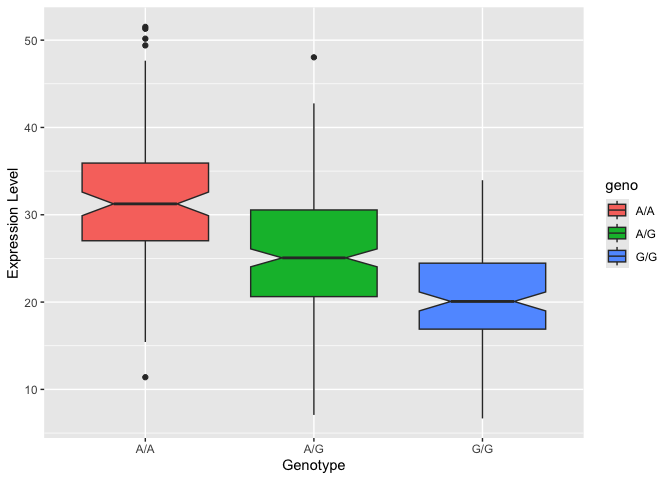

# Class 12 HW
Sarah Mirsaidi Madjdabadi, A16890186

## Section 4: Population Scale Analysis

One sample is obviously not enough to know what is happening in a
population. You are interested in assessing genetic differences on a
population scale. So, you processed about ~230 samples and did the
normalization on a genome level. Now, you want to find whether there is
any association of the 4 asthma-associated SNPs (rs8067378…) on ORMDL3
expression.

> Q13: Read this file into R and determine the sample size for each
> genotype and their corresponding median expression levels for each of
> these genotypes.

``` r
expr <- read.table("rs8067378_ENSG00000172057.6.txt")
head(expr)
```

       sample geno      exp
    1 HG00367  A/G 28.96038
    2 NA20768  A/G 20.24449
    3 HG00361  A/A 31.32628
    4 HG00135  A/A 34.11169
    5 NA18870  G/G 18.25141
    6 NA11993  A/A 32.89721

``` r
nrow(expr)
```

    [1] 462

``` r
# total number of samples
```

``` r
table(expr$geno)
```


    A/A A/G G/G 
    108 233 121 

``` r
# sample size for each genotype
```

A/A Median Expression level: 31.25

``` r
summary(expr$exp[expr$geno == "A/A"])
```

       Min. 1st Qu.  Median    Mean 3rd Qu.    Max. 
      11.40   27.02   31.25   31.82   35.92   51.52 

A/G Median Expression level: 25.065

``` r
summary(expr$exp[expr$geno == "A/G"])
```

       Min. 1st Qu.  Median    Mean 3rd Qu.    Max. 
      7.075  20.626  25.065  25.397  30.552  48.034 

G/G Median Expression level: 20.074

``` r
summary(expr$exp[expr$geno == "G/G"])
```

       Min. 1st Qu.  Median    Mean 3rd Qu.    Max. 
      6.675  16.903  20.074  20.594  24.457  33.956 

> Q14: Generate a boxplot with a box per genotype, what could you infer
> from the relative expression value between A/A and G/G displayed in
> this plot? Does the SNP effect the expression of ORMDL3?

``` r
library(ggplot2)
```

``` r
ggplot(expr) + aes(x=geno, y=exp, fill=geno) +
  geom_boxplot(notch=TRUE) +
  labs(x = "Genotype", y = "Expression Level")
```



Having G/G in this location is associated with having a reduced
expression of ORMDL3 (no overlap in notches, significant difference);
yes, SNP does impact gene expression.
