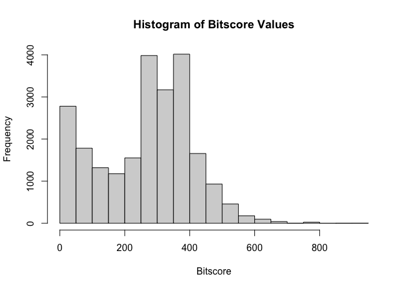
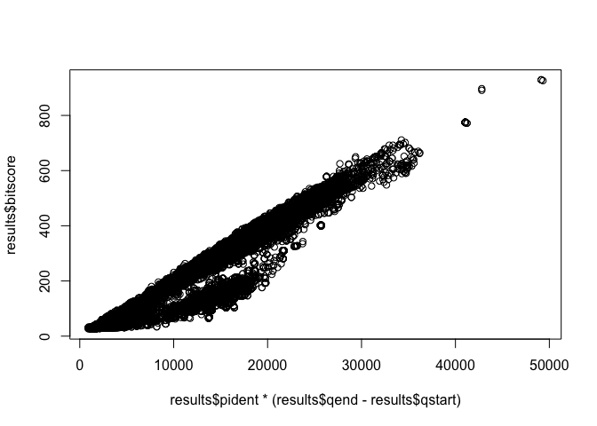
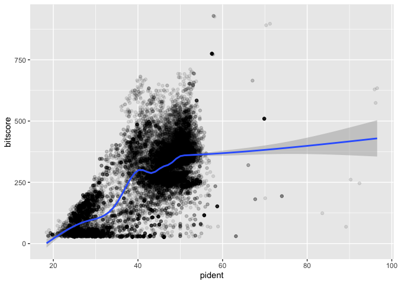

# Class 16: Figure HW
Sarah Mirsaidi Madjdabadi, A16890186

``` r
results <- read.table("results.tsv", header = TRUE, sep = "\t")
```

``` r
colnames(results) <- c("qseqid", "sseqid", "pident", "length", "mismatch", "gapopen", "qstart", "qend", "sstart", "send", "evalue", "bitscore")
```

``` r
hist(results$bitscore, breaks = 30, main = "Histogram of Bitscore Values",
     xlab = "Bitscore")
```



- Most values cluster between 0 and 400
- The graph skews to the right
- Multi-modal distribution
- More lower results

Is there a straightforward relationship between percent identity
($pident) and bitscore ($bitscore) for the alignments we generated?

The answer is that bitscores are only somewhat related to pident; they
take into account not only the percent identity but the length of the
alignment. You can get a napkin sketch estimate of this by doing the
following:

``` r
plot(results$pident  * (results$qend - results$qstart), results$bitscore)
```



Using ggplot:

``` r
library(ggplot2)
ggplot(results, aes(pident, bitscore)) + geom_point(alpha=0.1) + geom_smooth()
```

    `geom_smooth()` using method = 'gam' and formula = 'y ~ s(x, bs = "cs")'


